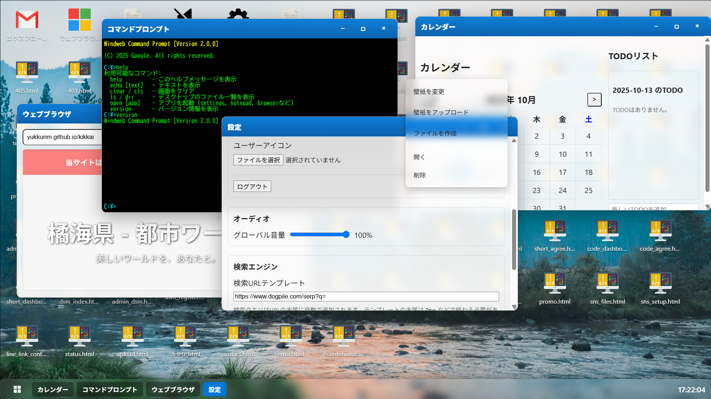

# Windweb 

**Windweb Desktop** は、ブラウザ上で動作する軽量な仮想OS環境です。  
ユーザーはまるで実際のデスクトップOSを操作しているかのように、  
アプリを起動したり、ファイルを作成・編集・保存したりすることができます。



---

## 特徴

- 🪟 **ウィンドウ管理システム**
  - ドラッグ、リサイズ、最小化・最大化、フォーカス切り替えが可能。
  - 複数アプリを同時に開いて作業できます。

- 💾 **ローカルストレージによる永続化**
  - 作成したファイルや設定、壁紙などは `localStorage` に保存され、ブラウザを再起動しても維持されます。

- 🎨 **カスタマイズ可能なUI**
  - 壁紙・テーマ（ライト／ダーク）・カーソル画像を自由に変更可能。
  - ガラス風エフェクトを採用したモダンなデザイン。

- 👤 **マルチユーザー対応**
  - サインイン・ユーザー作成・削除が可能。
  - 各ユーザーごとに独立したデスクトップ環境と設定を保持。

- **内蔵アプリ**
  | アプリ名 | 機能概要 |
  |-----------|-----------|
  | エクスプローラー | ファイルやアプリの管理 |
  | メモ帳 | テキストファイルの作成・編集・保存 |
  | ウェブブラウザ | 簡易ブラウジング＆検索対応 |
  | コマンドプロンプト | OS内アプリの起動、ファイル一覧表示など |
  | ミュージックプレイヤー | 音楽や動画ファイルの再生 |
  | 時計 | 現在時刻と日付の表示 |
  | カレンダー | TODOリスト統合カレンダー |
  | テトリス | シンプルなゲーム |
  | 設定 | 壁紙・テーマ・音量・カーソルなどの管理 |

- **ブラウザ内検索**
  - デフォルトで `Dogpile` 検索エンジンを使用。
  - 任意の検索エンジンURLに変更可能。

- **オフラインで動作**
  - すべてのデータはブラウザ内部に保存されるため、ネットワーク接続不要で利用可能。

---

## 技術構成

| 技術 | 用途 |
|------|------|
| HTML5 / CSS3 | UI構築、デスクトップレイアウト |
| JavaScript (Vanilla) | アプリ管理・イベント処理・ウィンドウ管理 |
| LocalStorage API | 状態保存・ユーザーデータ永続化 |
| WebAudio / Blob / DataURL | 音声・動画・HTMLファイルの扱い |
| Accessibility API | キーボード操作やARIA対応 |

---

## セットアップ

### 1. ローカル実行
```bash
git clone https://github.com/yourname/windweb-desktop.git
cd windweb-desktop
````

その後、`pc.html` をブラウザで開くだけで実行可能です。

```
windweb-desktop/
├─ pc.html        # メインファイル
├─ static/
│   ├─ favicon.png
│   └─ icons/
└─ README.md
```

### 2. Webサーバーでホスト

任意のWebサーバーに `pc.html` と関連ファイルをアップロードするだけで動作します。

---

## 貢献方法

Windweb Desktop はオープンな仮想OSプロジェクトです。
改善提案や機能追加を歓迎します。

### 貢献の流れ

1. このリポジトリを **フォーク**
2. 新しいブランチを作成

   ```bash
   git checkout -b feature/add-awesome-function
   ```
3. コードを修正・追加
4. `README.md` や `CHANGELOG.md` に更新内容を記載
5. プルリクエストを作成し、変更点を明記

### 開発時の指針

* 依存ライブラリを極力使用しない（Vanilla JS中心）
* **アクセシビリティ** と **レスポンシブ対応** を重視
* コードは ES2020+ 仕様で記述
* UI/UXの一貫性を保つこと

---

## 今後の計画

* 🧠 仮想ネットワーク・ファイル共有機能
* 📁 JSONベースの外部バックアップインポート/エクスポート改善
* ⚙️ プラグインAPI
* 🎨 壁紙ギャラリーやテーマ配信システム
* 🪄 ウィンドウアニメーション強化

---

## ライセンス

このプロジェクトは [MIT License](LICENSE) のもとで公開されています。
自由に利用・改変・再配布が可能です。


```

